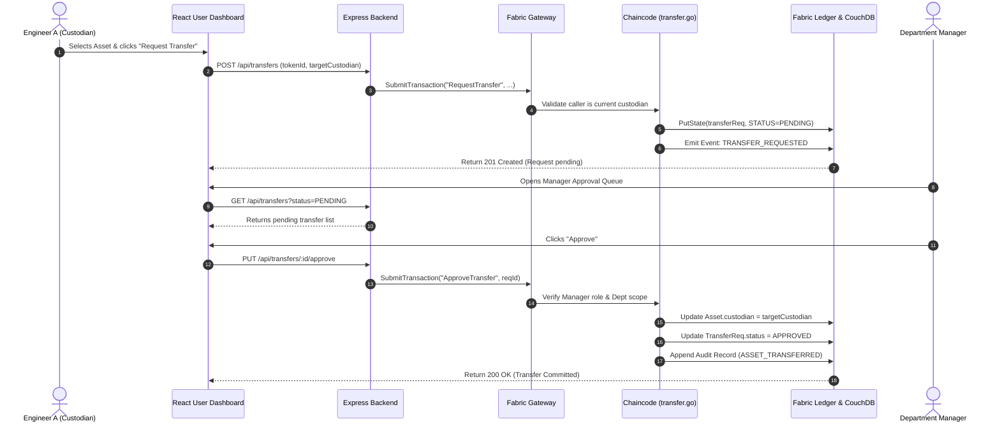
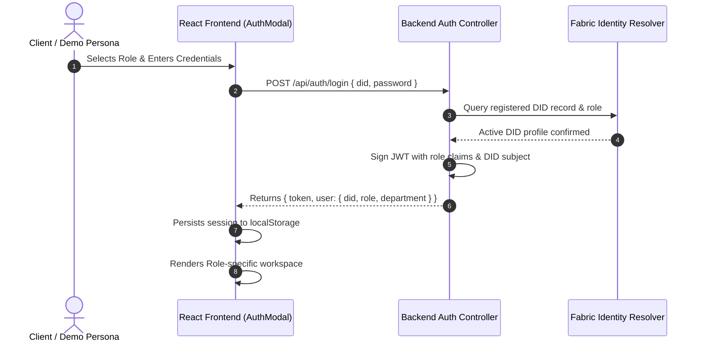

# BLOCKSHIELD — System Architecture & Modular Design

> **Document Version**: 2.0  
> **Target Platform**: Hyperledger Fabric 2.5, Node.js / Express, React 19 / Vite  
> **Status**: Active Architecture Guide

---

## 1. System Architecture Overview

BLOCKSHIELD is an enterprise-grade, cryptographically verifiable identity and asset governance platform designed for high-security defense and industrial environments (such as Bharat Electronics Limited / BEL).

The system decouples **Legal Asset Ownership** (e.g. `BEL`) from **Operational Custody** (e.g. `did:sih26125:N123456`), enforces smart-contract-level **Role-Based Access Control (RBAC)** on a permissioned Hyperledger Fabric ledger, and produces an immutable, tamper-evident audit stream for all security-sensitive actions.

### High-Level Topology

```text
┌────────────────────────────────────────────────────────────────────────┐
│                        PRESENTATION LAYER                              │
│   React 19 + Vite Modular Single Page Application                      │
│   (Features: Admin, Manager, Auditor, User, Communication, Portal)     │
│   Port: 5173 (Default) / 5174 (Admin) / 5175 (Manager) / 5176 (Auditor)│
└───────────────────────────────────┬────────────────────────────────────┘
                                    │ HTTP / JSON REST APIs
                                    ▼
┌────────────────────────────────────────────────────────────────────────┐
│                        API & INTEGRATION LAYER                         │
│   Node.js + Express REST API Gateway (Port 5000)                       │
│   - JWT / DID Authentication Middleware & Input Sanitization           │
│   - Cryptographic Signature Verification                               │
│   - Feature Controllers (DIDs, NFTs, Transfers, Audit, Messages)       │
│   - Fabric Gateway Connection Pool & Resilient Fallback Store          │
└───────────────────────────────────┬────────────────────────────────────┘
                                    │ gRPC over TLS (Ports 7051 / 9051)
                                    ▼
┌────────────────────────────────────────────────────────────────────────┐
│                     PERMISSIONED BLOCKCHAIN LAYER                      │
│   Hyperledger Fabric 2.5 Enterprise Network                            │
│   - Channel: mychannel                                                 │
│   - Raft Consensus Ordering Service (Port 7050)                        │
│   - Peer 0 Org1 (7051) & Peer 0 Org2 (9051) with Gossip Protocol       │
│   - World State DB: CouchDB 0 (5984) & CouchDB 1 (7984)                │
└───────────────────────────────────┬────────────────────────────────────┘
                                    │ Chaincode API
                                    ▼
┌────────────────────────────────────────────────────────────────────────┐
│                         SMART CONTRACT LAYER                           │
│   Go Chaincode Contract: sih26125                                      │
│   ├── identity.go  ── DID Lifecycle (Create, Read, Revoke)             │
│   ├── rbac.go      ── Role Security Boundary (ADMIN/MGR/AUDIT/USER)   │
│   ├── nft.go       ── Digital/Physical Asset Tokenization & Custody    │
│   ├── transfer.go  ── Custodian Transfer Request & Multi-Step Approval │
│   └── audit.go     ── Immutable On-Ledger Audit Event Generator        │
└────────────────────────────────────────────────────────────────────────┘
```

---

## 2. Frontend Architecture (Feature-Based)

The frontend adopts a **Feature-Based Modular Architecture**. Rather than grouping code by technical type (`components/`, `views/`) into massive monolithic files, code is structured around functional business domains.

### Target Directory Structure

```text
frontend/src/
├── app/                        # Application bootstrap, routing & providers
│   ├── App.jsx                 # Minimal composition root (< 80 LOC)
│   ├── AppRoutes.jsx           # Declarative role & view routing
│   └── providers/              # Auth, Theme, and Socket context providers
│
├── features/                   # Autonomous feature modules
│   ├── admin/                  # Identity, Asset Minting, Global RBAC
│   │   ├── components/         # AdminOverview, IdentityTable, AssetMintModal
│   │   ├── services/           # adminApi.js
│   │   ├── hooks/              # useAdminDashboard.js
│   │   └── index.js            # Public feature API export
│   │
│   ├── manager/                # Department custody & transfer approvals
│   │   ├── components/         # ApprovalQueue, DeptAssetList, MemberList
│   │   ├── services/           # managerApi.js
│   │   ├── hooks/              # useManagerDashboard.js
│   │   └── index.js
│   │
│   ├── auditor/                # Provenance explorer, compliance, audit stream
│   │   ├── components/         # ProvenanceTimeline, AuditLogTable, IntegrityBadge
│   │   ├── services/           # auditorApi.js
│   │   ├── hooks/              # useAuditorDashboard.js
│   │   └── index.js
│   │
│   ├── user/                   # Custodian workspace, transfer requests
│   │   ├── components/         # MyAssetsGrid, RequestTransferModal, KeyProfile
│   │   ├── services/           # userApi.js
│   │   ├── hooks/              # useUserDashboard.js
│   │   └── index.js
│   │
│   └── communication/          # Real-time encrypted team chat & task delegation
│       ├── components/         # ChatThread, TaskDelegationBoard, ChannelList
│       ├── services/           # communicationApi.js
│       ├── hooks/              # useCommunication.js
│       └── index.js
│
├── components/                 # Shared, domain-agnostic UI building blocks
│   └── ui/                     # Button, Modal, Card, Table, Badge, Input, Toast
│
├── services/                   # Shared network infrastructure
│   ├── api.js                  # Axios/Fetch client with interceptors
│   └── fabricApi.js            # Shared ledger endpoint methods
│
├── utils/                      # Pure helper functions
│   ├── formatters.js           # Date, DID, and token string formatters
│   ├── listParsers.js          # Resilient array/object list parser
│   └── sanitizers.js           # XSS & input cleanups
│
├── styles/                     # Modular design system
│   ├── variables.css           # Color tokens, spacing, typography scales
│   ├── globals.css             # Base resets and typography
│   └── layout.css              # Grid systems, sidebar layouts, header bars
│
└── constants/                  # Static platform configurations
    └── demoUsers.js            # Hardcoded demo identities for evaluation
```

---

## 3. Backend Architecture

The backend adheres to a clean **Route ➔ Controller ➔ Service ➔ Blockchain Gateway** layering pattern.

```text
backend/
├── src/
│   ├── config/                 # Network addresses, JWT secrets, TLS certs
│   │   └── fabric.config.js
│   ├── routes/                 # Express route definitions
│   │   ├── did.routes.js       # /api/dids
│   │   ├── nft.routes.js       # /api/nfts
│   │   ├── transfer.routes.js  # /api/transfers
│   │   ├── audit.routes.js     # /api/audit
│   │   ├── auth.routes.js      # /api/auth
│   │   └── messages.routes.js  # /api/messages
│   ├── controllers/            # HTTP request/response validation & serialization
│   │   ├── did.controller.js
│   │   ├── nft.controller.js
│   │   ├── transfer.controller.js
│   │   ├── audit.controller.js
│   │   ├── auth.controller.js
│   │   └── messages.controller.js
│   ├── services/               # Core business rules & orchestration
│   │   ├── did.service.js
│   │   ├── nft.service.js
│   │   ├── transfer.service.js
│   │   └── audit.service.js
│   ├── middleware/             # Cross-cutting concerns
│   │   ├── auth.middleware.js  # Token & DID verification
│   │   ├── rbac.middleware.js  # Route-level persona checks
│   │   └── errorHandler.js    # Standardized JSON error response
│   ├── fabric/                 # Hyperledger Fabric integration
│   │   ├── gateway.js          # Production gRPC gateway to peer nodes
│   │   ├── mockStore.js        # Decoupled in-memory fallback for local dev
│   │   └── wallet.js           # Identity MSP credentials loader
│   └── server.js               # Express application initialization
```

---

## 4. Blockchain & Chaincode Architecture

The smart contract is implemented in Go using `fabric-contract-api-go` and deployed to `mychannel` under the chaincode label `sih26125`.

### Chaincode Security Boundaries

1. **`identity.go`**:
   - `CreateIdentity(ctx, did, pubKey, role, dept)` — Restricted to `ADMIN`.
   - `RevokeIdentity(ctx, did)` — Restricted to `ADMIN`.
   - `GetIdentity(ctx, did)` — Open to authenticated participants.
   - `GetAllIdentities(ctx)` — Restricted to `ADMIN` and `AUDITOR`.

2. **`rbac.go`**:
   - Evaluates client X.509 certificate attributes, MSP ID (`Org1MSP`, `Org2MSP`), and on-chain DID identity records.
   - Unauthorized attempts abort transaction execution with an explicit error and record an `ACCESS_DENIED` event in the audit trail.

3. **`nft.go`**:
   - `MintAsset(ctx, tokenId, assetId, assetName, assetType, legalOwner, custodian, dept, loc, hash)` — Restricted to `ADMIN`.
   - `RevokeAsset(ctx, tokenId)` — Restricted to `ADMIN`.
   - `GetAsset(ctx, tokenId)` — Open to all authenticated users.
   - `GetAllAssets(ctx)` — Filtered by caller role/department in production.

4. **`transfer.go`**:
   - `RequestTransfer(ctx, requestId, tokenId, targetCustodian)` — Callable only by the active custodian of the asset.
   - `ApproveTransfer(ctx, requestId)` — Callable by `MANAGER` or `ADMIN`. Atomically updates `asset.custodian` and emits `ASSET_TRANSFERRED`.
   - `RejectTransfer(ctx, requestId, reason)` — Callable by `MANAGER` or `ADMIN`.

5. **`audit.go`**:
   - Appends tamper-evident audit records (`docType: "audit"`) to the world state whenever any lifecycle event occurs.
   - `GetAuditLogs(ctx)` — Restricted to `AUDITOR` and `ADMIN`.

---

## 5. End-to-End Data & Execution Flows

### 5.1 Custodian Transfer Workflow



### 5.2 Authentication & Signature Verification Flow



---

## 6. Collaboration Hotspots (Phase 12)

Certain files serve foundational or infrastructural roles across multiple features. Uncoordinated modifications to these files are the most frequent source of Git merge conflicts.

| Hotspot File | Nature of Shared Responsibility | Normal Owner / Coordinator | Coordination Protocol |
| :--- | :--- | :--- | :--- |
| **`frontend/src/App.jsx`** | Central composition of router, global providers, and top-level modals. | **Core UI Architect** | Do not add feature business logic here. Features must register routes via declarative configuration. |
| **`frontend/src/styles/variables.css` & `globals.css`** | Shared color tokens, typography scales, layout variables, and resets. | **Design System Lead** | Never introduce feature-specific classes here. Use feature-level `styles.css` files instead. |
| **`frontend/package.json` & `backend/package.json`** | Dependencies, runtime scripts, and versioning. | **DevOps / Team Lead** | Announce new library additions in team chat before modifying package files. Run `npm install` cleanly. |
| **`frontend/src/services/api.js`** | Axios/Fetch HTTP client configuration, headers, and interceptors. | **API / Middleware Lead** | Feature developers should export domain methods from `features/<feature>/services/`, not edit the base client directly. |
| **`backend/src/fabric/gateway.js`** | Blockchain connection lifecycle, gRPC channels, and mock store fallback. | **Blockchain / Fabric Lead** | Keep chaincode method wrappers modular. Do not alter fallback data schemas without sync with frontend. |
| **`backend/src/server.js`** | Top-level Express middleware, port binding, and route mounting. | **Backend Lead** | New endpoints must be packaged as router modules (`routes/<domain>.routes.js`) and mounted cleanly in 1 line. |
| **`frontend/src/constants/demoUsers.js`** | Demo identities, credentials, and seed profiles. | **QA / Test Lead** | Add new test personas here without modifying existing persona passwords or roles. |

---

## 7. Architectural Decisions & Guardrails

1. **Zero Private Key Exposure**: Private keys are never accepted by API endpoints or committed to version control.
2. **Chaincode as Ultimate Source of Truth**: Backend API validation provides friendly error messages, but the smart contract enforces cryptographic authorization rules.
3. **Resilient Dual-Mode Operation**: When Hyperledger Fabric nodes are active, transactions write directly to the distributed ledger. If network nodes are temporarily restarting during development, the gateway gracefully falls back to the in-memory mock store without breaking frontend usability.
4. **Resilient List Normalization**: All UI components utilize the shared `parseList` utility to safely handle both array responses `[...]` and key-value maps `{ id: {...} }` without crashing.
