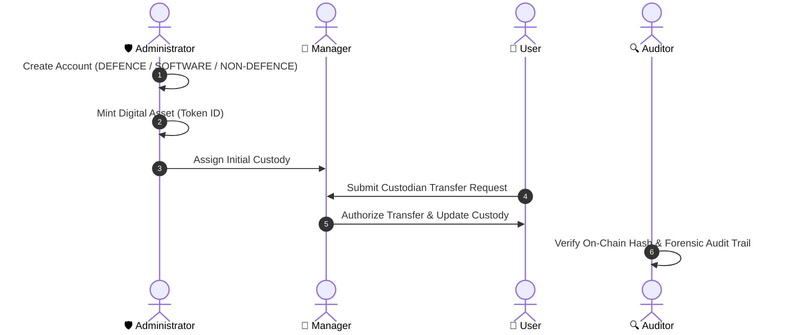

# BLOCKSHIELD: Comprehensive Testing, Login & Operations Manual

---

## 1. Executive Project Overview

**BLOCKSHIELD** is an enterprise-grade, decentralized trust infrastructure engineered for sovereign institutions, defence organizations (such as Bharat Electronics Limited - BEL), and high-security technology enterprises. Built atop **Hyperledger Fabric (v2.5+)** permissioned distributed ledger and synchronized with **MongoDB (v7)**, BLOCKSHIELD eliminates single points of failure in identity issuance, access governance, and physical/digital asset custody.

### Core Architectural Pillars
- **Decentralized Identifiers (DIDs)**: Cryptographic identity issuance complying with W3C DID standards (`did:sih26125:<ID>`).
- **Tri-Tier Identity Categorization**:
  1. **Defence & Government Personnel**: Requiring Official Service ID, Department Verification, and Government Identification.
  2. **Software & Technology Partners**: Requiring Employee Identification, Corporate Email Domain Verification, and Organization Authorization.
  3. **Non-Defence Users**: Requiring National IDs (Aadhaar, Passport, Driving Licence, Voter ID).
- **Exclusive Administrative Governance**: Only authorized System Administrators hold the cryptographic privilege to issue DIDs and register User, Manager, and Auditor accounts.
- **Tokenized Asset Custody**: High-value testing equipment, mission-critical hardware, and digital artifacts are minted as non-fungible ledger tokens with full cryptographic provenance.
- **Two-Party Custodial Transfers**: Users submit transfer requests to target custodians with operational justifications; designated Department Managers must cryptographically authorize or reject every transfer.

---

## 2. Infrastructure & Service Endpoints

| Component | Endpoint | Protocol / Port | Container / Process |
| :--- | :--- | :--- | :--- |
| **Frontend Portal** | [http://localhost:5173](http://localhost:5173) | HTTP / React (Vite) | `npm run dev` |
| **Backend REST API** | [http://localhost:5000](http://localhost:5000) | Express / Node.js | `node src/server.js` |
| **Persistent Database** | `mongodb://localhost:27017/blockshield` | MongoDB Native | Docker: `blockshield-mongo` |
| **Blockchain Network** | Peer: `peer0.org1.example.com:7051` | gRPC / TLS | Hyperledger Fabric |
| **Ledger Channel & Chaincode** | Channel: `mychannel` | Chaincode: `sih26125` | Endorsed by Org1 MSP |

---

## 3. Login Guide & 1-Click Demo Accounts

All credentials below are seeded in MongoDB on startup and validated against the Hyperledger Fabric ledger:

| Role | Username / ID | Password | Decentralized Identifier (DID) | Category / Proof Profile |
| :--- | :--- | :--- | :--- | :--- |
| 🛡️ **Administrator** | `ADMIN001` *(or `ADMIN-001`)* | `password123` | `did:sih26125:ADMIN001` | **Defence / Gov** (BEL Executive Governance: `BEL-EXEC-001`) |
| 💼 **Manager** | `MANAGER001` *(or `MANAGER-002`)* | `password123` | `did:sih26125:MANAGER001` | **Defence / Gov** (BEL R&D Operations: `BEL-MGR-001`) |
| 🔍 **Auditor** | `AUDITOR001` *(or `AUDITOR-001`)* | `password123` | `did:sih26125:AUDITOR001` | **Software / Tech** (Tech Audit Unit: `TECH-AUD-001`) |
| 👤 **User (Primary)** | `USER001` *(or `USER-014`)* | `password123` | `did:sih26125:USER001` | **Defence / Gov** (BEL Engineering: `BEL-EMP-9821`) |
| 👤 **User (Secondary)** | `N123456` | `password123` | `did:sih26125:N123456` | **Software / Tech** (Specialist: `TECH-USR-042`) |

### Instant 1-Click Sign In
1. Navigate to the Central Portal at [http://localhost:5173](http://localhost:5173).
2. Click any of the 4 workspace cards (**Admin**, **Manager**, **Auditor**, or **User**).
3. The Authentication Modal opens.
4. Click any chip in the **⚡ 1-Click Instant Sign In** row at the top (`ADMIN001`, `MANAGER001`, `AUDITOR001`, `USER001`, `N123456`).
5. The system authenticates directly against MongoDB and immediately launches your designated workspace.

---

## 4. Role-by-Role Step-by-Step Testing Procedures



---

### Workflow 1: 🛡️ Administrator Workspace Testing

#### Test 1.1: Issue a New Identity with Category Proofs
1. Log in as `ADMIN001`.
2. Click **Create Identity** on the left navigation bar.
3. Select a **User Category**:
   - **Defence / Government**:
     - Identity Proof: Government ID (`GOV-DEF-9021`)
     - Official Service ID: `BEL-RADAR-401`
     - Department: `Radar & Missile Systems`
   - **Software / Technology**:
     - Identity Proof: Aadhaar (`AADHAAR-9011-2233-4455`)
     - Official Employee ID: `TECH-SW-102`
     - Corporate Email: `engineer@partner.bel.in`
   - **Non-Defence**:
     - Identity Proof: Driving Licence (`DL-KA-2024-8839`)
4. Fill in:
   - Username: `ENGINEER88`
   - Full Name: `Siddharth Verma`
   - Assigned Role: `USER`
   - Password: `password123`
5. Click **Issue Cryptographic DID & Register**.
6. **Expected Result**: 
   - DID `did:sih26125:ENGINEER88` is issued on Fabric and saved into MongoDB.
   - User appears in the **Directory** tab.
   - You can test logging in immediately with username `ENGINEER88` and password `password123`.

#### Test 1.2: Mint Digital Asset (Tokenization)
1. Click **Create Asset** (or `Asset Tokenization`).
2. Input asset details:
   - Token ID: `NFT-5001`
   - Asset ID / Model: `BEL-RADAR-TX-99`
   - Asset Name: `X-Band Radar Transmitter`
   - Asset Type: `HARDWARE`
   - Initial Custodian DID: `did:sih26125:USER001`
   - Location: `R&D Testing Complex, Sector 4`
3. Click **Mint Asset on Hyperledger Fabric**.
4. **Expected Result**: Success notification appears; the asset is recorded on the ledger, persisted to MongoDB, and visible in all asset listings.

#### Test 1.3: Cryptographic Audit Trail Review
1. Click **Audit Trail** on the sidebar.
2. View real-time transactions with actions, actor DIDs, resource IDs, and block timestamps.

---

### Workflow 2: 💼 Manager Workspace Testing

#### Test 2.1: Department Asset Oversight
1. Log in as `MANAGER001`.
2. Open **Department Assets** tab.
3. Verify that all assets allocated to department personnel (`NFT-1001`, `NFT-1002`, `NFT-5001`) are listed with current custody status.

#### Test 2.2: Review & Authorize Custodian Transfer Request
1. In the **Overview** tab, check the **"Needs your attention"** banner showing the latest transfer request.
2. Click **Transfer Requests** on the sidebar.
3. Locate the pending transfer request in the table.
4. Click **Authorize Transfer** (or **Reject** with a formal reason).
5. **Expected Result**:
   - Status changes to `APPROVED`.
   - Asset custodian updates to the target DID on both MongoDB and Hyperledger Fabric.
   - An immutable transaction is logged to the audit trail.

---

### Workflow 3: 👤 User Workspace Testing

#### Test 3.1: Custodial Asset View
1. Log in as `USER001`.
2. The **Overview** tab displays all assets currently assigned to `USER001` (e.g., `NFT-1002`).
3. Click **View asset →** to review historical transfers and chain of custody.

#### Test 3.2: Submit a Custodian Transfer Request
1. Click **Request Transfer** tab.
2. Select your allocated asset (e.g., `NFT-1002`).
3. Enter Target Custodian DID: `did:sih26125:MANAGER001` (or select from directory).
4. Enter Reason: `Routine laboratory calibration and firmware upgrade`.
5. Click **Submit Custodian Transfer Request**.
6. **Expected Result**:
   - Success toast appears.
   - Status transitions to `PENDING` under the **Transfer Requests** tab.
   - Manager receives notification of the pending request.

#### Test 3.3: Verify Asset Cryptographic Integrity
1. Click **Verify Integrity** tab.
2. Enter Token ID: `NFT-1002`.
3. Click **Verify On-Chain**.
4. **Expected Result**: Cryptographic verification badge confirms hash integrity against the Fabric ledger.

---

### Workflow 4: 🔍 Auditor Workspace Testing

#### Test 4.1: Forensic Log Table & Category Filtering
1. Log in as `AUDITOR001`.
2. Click **Forensic Log Table** tab.
3. Filter by category: `IDENTITY`, `ASSET`, `TRANSFER`, or `COMPLIANCE`.
4. Inspect actor DIDs, resource targets, and execution status (`SUCCESS` / `DENIED`).

#### Test 4.2: Asset & DID Verification
1. Click **Verify Assets / DIDs** tab.
2. Enter Token ID (`NFT-1001`) or DID (`did:sih26125:USER001`).
3. Click **Verify Cryptographic Proof**.
4. **Expected Result**: Complete tamper-detection analysis, creator provenance, and current cryptographic status are displayed.

---

## 5. Direct API Testing Commands (Curl)

You can run these curl commands in your terminal to test backend endpoints directly:

```bash
# 1. Test Login (Supports both normalized and hyphenated usernames)
curl -s -X POST http://localhost:5000/api/access/login \
  -H "Content-Type: application/json" \
  -d '{"identity":"ADMIN001","password":"password123"}'

# 2. Query All DIDs
curl -s http://localhost:5000/api/dids

# 3. Query All Tokenized Assets
curl -s http://localhost:5000/api/nfts

# 4. Query Assets by Custodian DID
curl -s "http://localhost:5000/api/nfts/owner/did:sih26125:USER001"

# 5. Create Transfer Request (User)
curl -s -X POST http://localhost:5000/api/transfers/request \
  -H "Content-Type: application/json" \
  -d '{
    "tokenId": "NFT-1002",
    "requestedByDID": "did:sih26125:USER001",
    "toDID": "did:sih26125:MANAGER001",
    "reason": "Department lab relocation"
  }'

# 6. Query Pending Transfer Requests (Manager)
curl -s http://localhost:5000/api/transfers/pending

# 7. Approve Transfer Request (Manager)
# Replace REQ_ID with the requestId from the pending query (e.g. TR-1791025694221)
curl -s -X POST http://localhost:5000/api/transfers/<REQ_ID>/approve \
  -H "Content-Type: application/json" \
  -d '{"approverDID": "did:sih26125:MANAGER001"}'

# 8. Query Merged Audit Trail
curl -s http://localhost:5000/api/audit
```

---

## 6. Service Management & Troubleshooting

- **Check Backend Log**:
  ```bash
  tail -n 50 backend.log
  ```
- **Inspect MongoDB Database Directly**:
  ```bash
  docker exec -it blockshield-mongo mongosh blockshield --eval "db.users.find({}, {username: 1, role: 1, userCategory: 1})"
  ```
- **Restart Backend Server**:
  ```bash
  cd backend && node src/server.js
  ```
- **Rebuild Frontend Bundle**:
  ```bash
  cd frontend && npm run build
  ```
